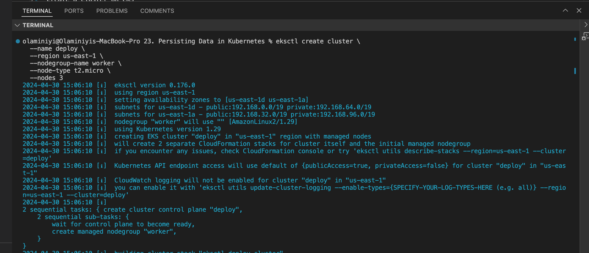
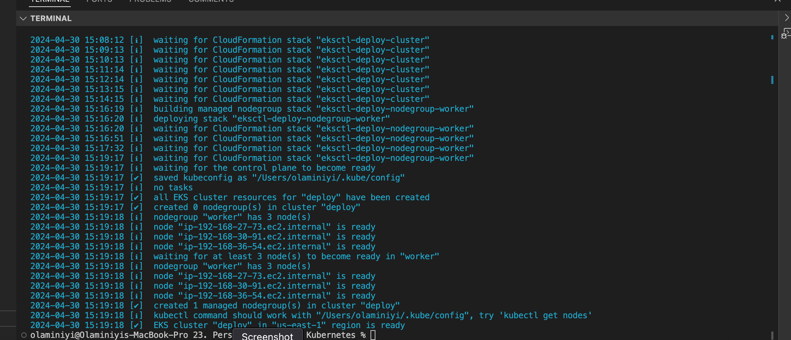
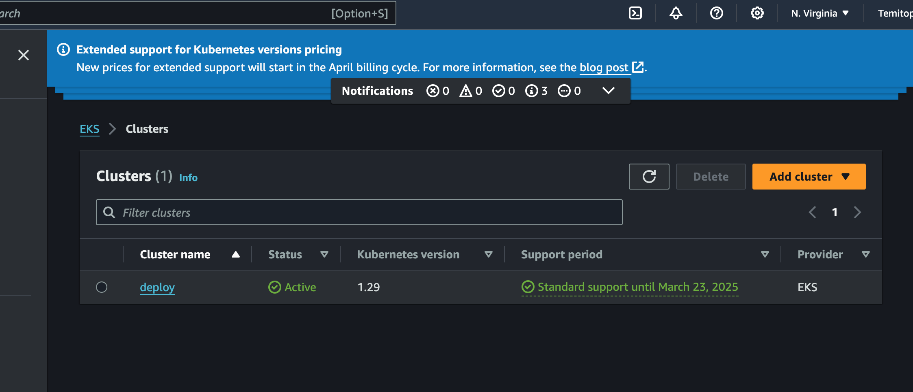
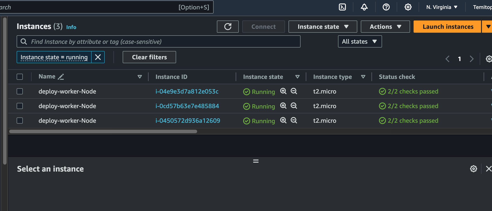

# 23. PERSISTING DATA IN KUBERNETES

Now, it is important to understand that containers in Kubernetes are designed to be stateless. This means that data doesn't persist within the containers. Even when you deploy containers within Kubernetes pods, they maintain their statelessness unless you specifically configure your environment to support statefulness.

Create a cluster on EKS

eksctl create cluster \
  --name deploy \
  --region us-east-1 \
  --nodegroup-name worker \
  --node-type t2.micro \
  --nodes 3

Create a deployment deploy.yml